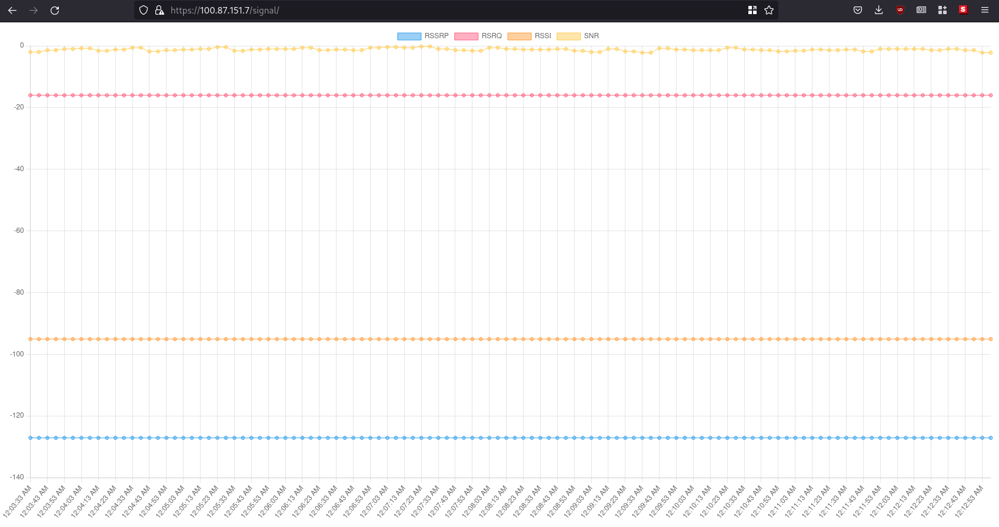

# openwrt-mobilebroadband-signal

A small utility to see the current Mobile Broadband (LTE / 5G) signal status on your OpenWRT router.



## Requirements

- An [OpenWRT](https://openwrt.org/) router
  - with a 3G / 4G / 5G module
  - with `ModemManager` installed (`mmcli`)
- [mbstatus](https://github.com/denysvitali/mbstatus)
- This repository

## Setup

### Requirements


- Make
- Go 1.19+ (to compile [`mbstatus`](https://github.com/denysvitali/mbstatus))

### Instructions

Assuming `192.168.1.1` is your OpenWRT router.

```
$ git clone https://github.com/denysvitali/openwrt-mobilebroadband-signal
$ git clone https://github.com/denysvitali/mbstatus
$ (cd mbstatus; make build-mipsle; scp build/mbstatus-mipsle root@192.168.1.1:/sbin/mbstatus)
$ cd openwrt-mobilebroadband-signal; \
  scp cgi-bin/signal root@192.168.1.1:/www/cgi-bin/signal && \
  scp -r signal root@192.168.1.1:/www/
```

Visit one of these two URLs to check that everything is working:
- https://192.168.1.1/signal (UI)
- https://192.168.1.1/cgi-bin/signal (JSON response)

Enjoy!

## Acknowledgments

- @etam ([Adam Mizerski](https://etam-software.eu/)) for the [original idea](https://gitlab.com/etam/uqmi_signal)